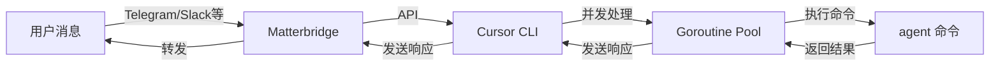

# Cursor CLI

Matterbridge API 客户端，用于将用户消息转发给 Cursor CLI 命令行执行，并将响应返回。

## 功能特性

- ✅ 支持 WebSocket 和轮询两种模式接收消息
- ✅ **并发处理**：消息异步处理，不阻塞后续消息
- ✅ **并发控制**：可配置最大并发数，避免资源耗尽
- ✅ 自动执行 Cursor CLI 命令处理用户消息
- ✅ 将 Cursor CLI 响应发送回 Matterbridge
- ✅ 消息去重，避免重复处理（线程安全）
- ✅ 错误处理和重连机制
- ✅ 使用 slog 进行日志记录

## 前置要求

1. **Matterbridge** 已安装并运行
2. **Cursor CLI** 已安装（`agent` 命令在 PATH 中）
3. **Go 1.18+**（用于编译）

## 快速开始

### 1. 编译程序

```bash
cd cursor_cli
go build -o cursor_cli main.go client.go
```

### 2. 配置 Matterbridge

#### 方式一：纯 API 测试（推荐，最简单）

使用提供的测试配置文件（**双端口配置，避免消息循环**）：

```bash
# 使用测试配置
./matterbridge -conf cursor_cli/matterbridge.toml
```

配置说明：
- **api.local (4242)**：用于 `test_local.sh` 发送测试消息
- **api.local2 (4243)**：用于 `cursor_cli` 接收消息
- 两个 API 在同一个 gateway 中，消息会自动转发

或者手动创建 `matterbridge.toml`（单端口配置）：

```toml
[api.local]
BindAddress="127.0.0.1:4242"
Token="mytoken"
Buffer=1000

[[gateway]]
name="mygateway"
enable=true
    [[gateway.inout]]
    account="api.local"
    channel="api"
```

**推荐使用双端口配置**，可以避免消息循环问题。

#### 方式二：使用其他协议（如 Telegram）

```toml
[api.local]
BindAddress="127.0.0.1:4242"
Token="mytoken"
Buffer=1000

[[gateway]]
name="mygateway"
enable=true
    [[gateway.inout]]
    account="api.local"
    channel="api"
    
    # 添加你的协议桥接，例如 Telegram
    [[gateway.inout]]
    account="telegram.mybot"
    channel="-123456789"
```

### 3. 启动 Matterbridge

```bash
./matterbridge -conf cursor_cli/matterbridge.toml
```

### 4. 启动 Cursor CLI

**如果使用双端口配置**（推荐）：

```bash
# 使用 4243 端口（接收消息）
./cursor_cli \
  -api-url="http://127.0.0.1:4243" \
  -token="mytoken" \
  -gateway="mygateway" \
  -bot-username="AI Agent" \
  -mode="websocket" \
  -debug
```

**如果使用单端口配置**：

```bash
# 使用 4242 端口
./cursor_cli \
  -api-url="http://127.0.0.1:4242" \
  -token="mytoken" \
  -gateway="mygateway" \
  -bot-username="AI Agent" \
  -mode="websocket" \
  -debug
```

### 5. 测试

#### 方式一：使用测试脚本（推荐）

**如果使用双端口配置**：

```bash
# 发送测试消息（使用 4242 端口）
cd bash
./test_local.sh send "Hello, world!"

# 查看响应（如果有的话）
./test_local.sh get

# 健康检查
./test_local.sh health
```

**工作流程**：
```
test_local.sh (4242) 
    ↓ 发送消息
Matterbridge Gateway
    ↓ 转发消息
cursor_cli (4243) 
    ↓ 执行 agent
agent 命令
    ↓ 返回响应
cursor_cli (4243)
    ↓ 发送响应
Matterbridge Gateway
    ↓ 转发响应
test_local.sh (4242) 
    ↓ 接收响应
```

**如果使用单端口配置**，消息可能会循环，建议使用轮询模式或双端口配置。

#### 方式二：使用 curl

```bash
# 发送消息
curl -X POST http://127.0.0.1:4242/api/message \
  -H "Content-Type: application/json" \
  -H "Authorization: Bearer mytoken" \
  -d '{
    "text": "Hello, world!",
    "username": "Test User",
    "gateway": "mygateway"
  }'

# 获取响应
curl -H "Authorization: Bearer mytoken" http://127.0.0.1:4242/api/messages
```

#### 方式三：使用其他协议

在 Telegram/Slack 等群组中发送消息，Cursor CLI 会自动：
1. 接收消息
2. 调用 `agent` 命令处理
3. 将响应发送回群组

## 使用方法

### 基本使用

```bash
./cursor_cli \
  -api-url="http://127.0.0.1:4242" \
  -token="your-token" \
  -gateway="mygateway" \
  -bot-username="AI Agent" \
  -agent-cmd="agent" \
  -agent-args="--print" \
  -mode="websocket"
```

### 参数说明

| 参数 | 说明 | 默认值 |
|------|------|--------|
| `-api-url` | Matterbridge API URL | `http://127.0.0.1:4242` |
| `-token` | API 认证 Token（可选） | 空 |
| `-gateway` | Gateway 名称 | `mygateway` |
| `-bot-username` | Bot 用户名 | `AI Agent` |
| `-agent-cmd` | Cursor CLI 命令（agent 可执行文件） | `agent` |
| `-agent-args` | Cursor CLI 参数（逗号分隔） | `--print` |
| `-mode` | 运行模式：`websocket` 或 `polling` | `websocket` |
| `-interval` | 轮询间隔（仅 polling 模式） | `2s` |
| `-max-workers` | 最大并发处理数（0=不限制） | `10` |
| `-debug` | 启用调试日志 | `false` |

### 使用示例

#### 1. WebSocket 模式（推荐）

```bash
./cursor_cli \
  -api-url="http://127.0.0.1:4242" \
  -token="mytoken" \
  -gateway="mygateway" \
  -agent-cmd="agent" \
  -agent-args="--print,--output-format,text" \
  -mode="websocket" \
  -debug
```

#### 2. 轮询模式

```bash
./cursor_cli \
  -api-url="http://127.0.0.1:4242" \
  -token="mytoken" \
  -gateway="mygateway" \
  -agent-cmd="agent" \
  -mode="polling" \
  -interval="3s"
```

#### 3. 自定义 Cursor CLI 参数

```bash
./cursor_cli \
  -api-url="http://127.0.0.1:4242" \
  -gateway="mygateway" \
  -agent-cmd="agent" \
  -agent-args="--print,--output-format,text,--model,sonnet-4" \
  -mode="websocket"
```

#### 4. 使用完整路径的 Cursor CLI

```bash
./cursor_cli \
  -api-url="http://127.0.0.1:4242" \
  -token="mytoken" \
  -gateway="mygateway" \
  -agent-cmd="/usr/local/bin/agent"
```

#### 5. 配置并发处理数

```bash
# 设置最大并发数为 20
./cursor_cli \
  -api-url="http://127.0.0.1:4242" \
  -gateway="mygateway" \
  -max-workers=20

# 不限制并发数（谨慎使用）
./cursor_cli \
  -api-url="http://127.0.0.1:4242" \
  -gateway="mygateway" \
  -max-workers=0
```

## Matterbridge 配置

在 `matterbridge.toml` 中配置 API 桥接器：

```toml
[api.local]
BindAddress="127.0.0.1:4242"
Token="mytoken"
Buffer=1000

[[gateway]]
name="mygateway"
enable=true
    [[gateway.inout]]
    account="api.local"
    channel="api"
    
    # 其他协议的桥接配置
    [[gateway.inout]]
    account="telegram.mybot"
    channel="-123456789"
```

## 工作流程



1. 用户通过 Telegram/Slack 等发送消息
2. Matterbridge 将消息转发到 API
3. Cursor CLI 通过 WebSocket/HTTP 接收消息
4. **消息立即进入异步处理队列**（不阻塞）
5. Cursor CLI 在 goroutine 中并发执行 `agent` 命令
6. Cursor CLI 将响应发送回 Matterbridge API
7. Matterbridge 将响应转发回用户

### 并发处理说明

- **异步处理**：消息接收后立即进入处理队列，不等待处理完成
- **并发控制**：通过信号量限制同时处理的消息数量
- **线程安全**：消息去重使用互斥锁保护，避免重复处理
- **资源管理**：每个处理任务独立超时控制（5分钟）

## 高级配置

### 环境变量

可以通过环境变量设置配置：

```bash
export API_URL="http://127.0.0.1:4242"
export API_TOKEN="mytoken"
export GATEWAY="mygateway"
export BOT_USERNAME="AI Agent"
export AGENT_CMD="agent"
export MODE="websocket"

./cursor_cli
```

### 作为系统服务运行

创建 systemd 服务文件 `/etc/systemd/system/cursor-cli.service`：

```ini
[Unit]
Description=Matterbridge Cursor CLI
After=network.target

[Service]
Type=simple
User=your-user
WorkingDirectory=/path/to/cursor_cli
ExecStart=/path/to/cursor_cli/cursor_cli \
  -api-url="http://127.0.0.1:4242" \
  -token="mytoken" \
  -gateway="mygateway" \
  -mode="websocket"
Restart=always
RestartSec=10

[Install]
WantedBy=multi-user.target
```

启动服务：

```bash
sudo systemctl enable cursor-cli
sudo systemctl start cursor-cli
sudo systemctl status cursor-cli
```

## 注意事项

1. **Cursor CLI 命令路径**：确保 `agent` 命令在 PATH 中，或使用完整路径
2. **超时设置**：Cursor CLI 执行超时时间为 5 分钟，可通过修改代码调整
3. **消息去重**：使用消息 ID 进行去重，避免重复处理
4. **错误处理**：如果 Cursor CLI 执行失败，会将错误信息发送回用户

## 常见问题

### Q: 连接失败怎么办？

**A:** 检查以下几点：
1. Matterbridge 是否正在运行
2. API URL 和端口是否正确
3. Token 是否匹配
4. 防火墙是否阻止连接

### Q: Cursor CLI 命令找不到？

**A:** 
1. 确保 `agent` 命令在 PATH 中：`which agent`
2. 或使用完整路径：`-agent-cmd="/path/to/agent"`

### Q: 消息没有被处理？

**A:** 检查：
1. Gateway 名称是否匹配
2. Bot 用户名是否与消息发送者不同
3. 查看日志：使用 `-debug` 参数

### Q: 如何查看详细日志？

**A:** 使用 `-debug` 参数：

```bash
./cursor_cli -debug -api-url="..." -token="..." -gateway="..."
```

## 故障排查

### 连接失败

- 检查 Matterbridge 是否运行
- 检查 API URL 和端口是否正确
- 检查 Token 是否正确

### Cursor CLI 执行失败

- 检查 `agent` 命令是否在 PATH 中
- 检查 Cursor CLI 参数是否正确
- 查看调试日志：`-debug`

### 消息未处理

- 检查 Gateway 名称是否匹配
- 检查 Bot 用户名是否与消息发送者不同
- 查看日志确认消息是否被接收

### 查看日志

```bash
# 启用调试日志
./cursor_cli -debug ...

# 查看 Matterbridge 日志
./matterbridge -debug -conf cursor_cli/matterbridge.toml
```

### 测试 API 连接

```bash
# 健康检查
curl http://127.0.0.1:4242/api/health

# 获取消息（需要 Token）
curl -H "Authorization: Bearer mytoken" http://127.0.0.1:4242/api/messages
```

### 测试 Cursor CLI 命令

```bash
# 手动测试 agent 命令
agent --print "Hello, world!"
```

## 开发

### 代码结构

```
cursor_cli/
├── client.go      # 客户端核心逻辑
├── main.go        # 主程序入口
└── README.md      # 说明文档
```

### 扩展功能

可以修改 `ProcessMessage` 方法添加自定义处理逻辑，例如：
- 文件处理
- 消息过滤
- 多轮对话支持
- 上下文管理
